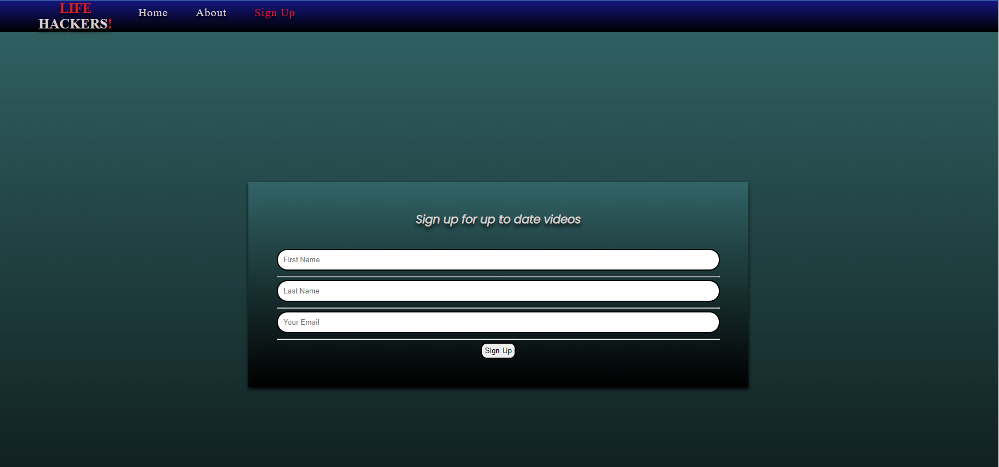
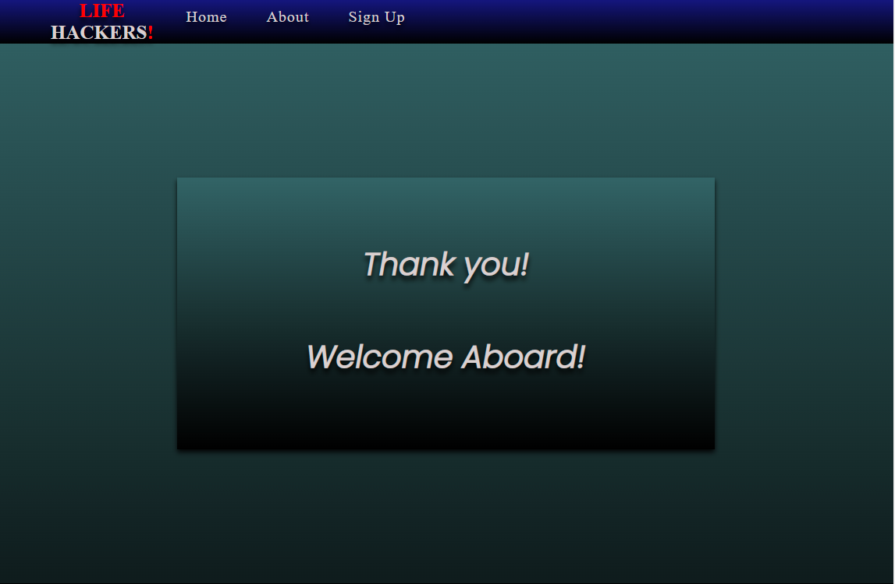

# <b style="color: rgb(212, 32, 32);">LIFE</b> HACKERS<b style="color: rgb(212, 32, 32);">!</b>
https://spur-tech.github.io/Life-Hackers-/

## Welcome Reader,

This is the section where you learn all about the page and the work that went into it.

## Project mission:

So <b style="color: rgb(212, 32, 32);">LIFE</b> HACKERS<b style="color: rgb(212, 32, 32);">!</b> is a website where you can come and watch videos about evreyday tasks like building, making things, packing, cleaning, and even survival techniques without the annoying adds. You can even sign up for up to date videos so you don't miss out on all the new stuff.
These videos will surely improve the way you think when you take on your next task.

## Site Author's mission:

I built this site for people to escape the annoying adds in youtube. It's built in a very simplistic way for ease of use with flowing colours throughout all pages and easy links to them, in the NAVBAR and also a the bottom of the page with links to social media sites like Facebook, Twitter, Instagram and Youtube.
I've added a copywright with my SPUR-<b style="color: rgb(212, 32, 32);">TECH </b>Web Designs logo in the footer.

## Wireframes:

These are the wireframes that started the ball rolling. 

- [Landing Page](assets/images/screenshot1.png)
- [About Page](assets/images/screenshot2.png)
- [Sign up Page](assets/images/screenshot3.png)
- [Thank you Page](assets/images/screenshot4.png)

##  Screen shot of the site and it's responsive abilities:

 

I used http://ami.responsivedesign.is/ to check what it would look like on all devices.
As you can see it's fully responsive right across all devices and the video grid changes and adapts to any screen size.

# Organisation:

All files are appropriately named with no capitalization or spaces and all in corrisponding folders.

- Assets
- css
- style.css
- images
- idex.html
- about.html
- signup.html
- thankyou.html
- README.md

## features:

All fonts were used from https://fontawesome.com/v5.15/icons?d=gallery&p=2&m=free and they were poppins and san serif

1. Thev NAVBAR has a blue gradient with striking red and white accents to really make it stand out for ease of use.
2. A hover over effect to show which one your about to press.
3. The link will stay red to show which page is active.
4. The gradient colour is consistant through-out.
5. Completely responsive on all devices.
6. This NAVBAR is pressent on all pages linking to the Home Page, About Page and Sign Up Page for ease of use.

# The landing page:

The landing page has a beautiful green gradient background with a bright bold heading and sub-heading for even the impaired to read easily. Scrolling down to the footer that's consistant through all the pages. The video grid is very simple to use and has a nice shadow casting for a 3d effect. Just hover over the box to enlarge or select full screen to get the full experience. All videos are muted until you select audio and you have full control of the video playing ability.

## Footer:

The footer consist of a black background to allow the white to really pop and links to follow on social media sites like Facebook, Twitter, Instagram and Youtube. for added easiness I've added the links to the other pages so you dont have to scroll back up.
I've faded out the links a little so when you hover over they light up in the beautiful green background colour.
I've tinted the background of the copywright logo in a grey colour as to not have any problems with seeing the red part and also looks a little more designer. 

## About Page:

The about page continues the flow of gradient colours, NAVBAR and blends into the footer. It contains an image of the author with a caption in the corner for screen readers and a short pargraph of what the site is about underneath.

## Sign up Page:

The sign up page again continues the gradient colours, NAVBAR and footer. The form has requirements to fill in so you are promted when you press submit too early to put your details in then a nice thank you card will pop up. All boxes have placeholders and aria-labels for the impaired.

## Thank you Page:

This is just a polite thank you card for signing with us for the newest videos.

# Testing:

First line of testing was to make sure links to each page worked in the NAVBAR and footer and also the submit button links to thank you page.

Then tested responsive effects on my phone, Ipad, laptop and pc all worked efficiently.

My testing for my css was performed on https://jigsaw.w3.org/css-validator/validator
and my testing for my html was performed on https://validator.w3.org/ after correcting everything it promted me on I now have no errors or warnings at all.

I also tested for accessibility on https://wave.webaim.org/ with only a nudge to add closed captions to videos but this caused more issues as it added tiny writnging in the corner which flagged up more warnings and effected the grid box so I added aria-labels to them.

# Bugs and Fixes:

 - Wow so I had a few issues with attaching the video box to a certain part of the background image then try to make it responsive and stay in the same place without crushing or warping so I opted for the gradient coloured background which I'm very pleased with and had alot compliments for.

 - My next bug was dealing with padding, margins and borders and getting strange things happen so it was a case of just trial and error until perfect.

 - Responsiveness was the next mission playing around with media queries until I'm happy with re-sizing right across the board.

 - I then checked with https://wave.webaim.org/ to asses colour contrast and adjusted accordingly.

 - Then added ARIA-Labels to my form page on the same site.  

# Credits:

This leads me perfectly into the next section.

I would like to say thank you to everyone on slack and espeacially DAISY_MENTOR and STEPHEN_5P_LEAD they have always been the fisrt to react to any issues and always ready to help I hope they see this metion of them they have been amazing.

Also a hat tip to my mentor Jack_mentor such a nice guy.

The videos used are all from Youtube.

Also some of the idea's and techniques were helpful on youtube to watch different ways to solve various problems I feel I've learnt sooo much by running into problems and fixing them.

## A credit to the following:

https://validator.w3.org/

https://jigsaw.w3.org/css-validator/

https://wave.webaim.org/

https://fonts.google.com/

https://fontawesome.com/v5.15/icons?d=gallery&p=2&m=free

https://www.youtube.com/

https://github.com/Code-Institute-Solutions/readme-template

# Deployment:

This site was developed in Gitpod, committed and pushed to Github, and deployed on GitHub Pages.

## How to deploy this site:

- Log in to Github then go to the repository you would like to deploy.
- Click on Settings in the toolbar.
- Click on Pages.
- Click on the Branch dropdown, and select Main.
- Click on Save.
- Click on the URL to navigate to the live site.

