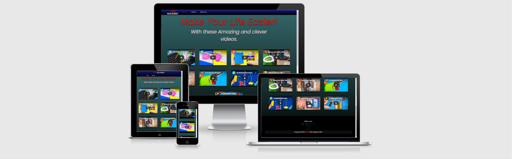
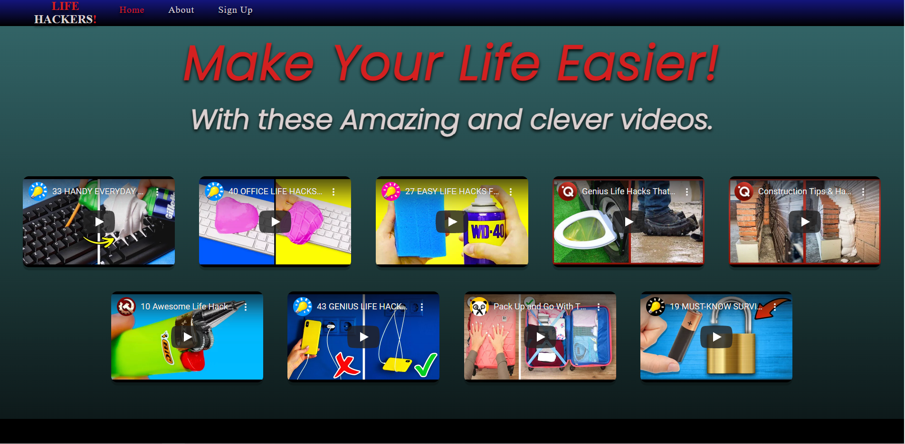
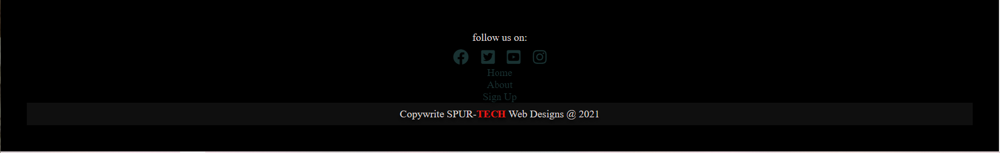
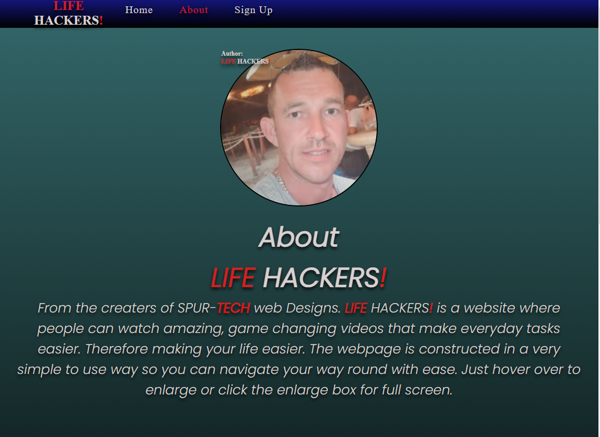

# <b style="color: rgb(212, 32, 32);">LIFE</b> HACKERS<b style="color: rgb(212, 32, 32);">!</b>
https://spur-tech.github.io/Life-Hackers-/

## Welcome Reader,

This is the section where you learn all about the page and the work that went into it.

## project mission:

So <b style="color: rgb(212, 32, 32);">LIFE</b> HACKERS<b style="color: rgb(212, 32, 32);">!</b> is a website where you can come and watch videos about evryday tasks like building, making things, packing, cleaning, and even survival techniques without the annoying adds. You can even sign up for up to date videos so you dont miss out on all the new stuff.
These videos will surely improve the way you think when you take on your next task.

## Site Author's mission:

I built this site for people to escape the annoying adds in youtube. It's built in a very simplistic way for ease of use with flowing colours throughout all pages and easy links to them, in the NAVBAR and also a the bottom of the page with links to Facebook, Twitter, Instagram and Youtube.
I've added a copywright with my SPUR-<b style="color: rgb(212, 32, 32);">TECH </b>Web Designs logo in the footer.

## Wireframes:

These are the wireframes that started the ball rolling. 

- [Landing Page](assets/images/screenshot1.png)
- [About Page](assets/images/screenshot2.png)
- [Sign up Page](assets/images/screenshot3.png)
- [Thank you Page](assets/images/screenshot4.png)

##  Screen shot of the site and it's responsive abilities:

 

I used http://ami.responsivedesign.is/ to check what it would look like on all devices.
As you can see it's fully responsive right across all devicesand the video grid changes and adapts to any screen size.

## features:

1. Thev navbar has a blue gradient with stricking red and white accents to really make it stand out for ease of use.
2. A hover over effect to show which one your about to press.
3. The link will stay red to show which page is active.
4. The gradient colour is consistant through-out.
5. Completely responsive on all devices.
6. This nav bar is pressent on all pages loinking to the Home Page, About Page and Sign Up Page for ease of use.

# The landing page:

The landing page has a beautiful green gradient background with a bright bold heading and sub-heading for even the impaired to read easily. Scrolling down to the footer that's consistant through all the pages. The video grid is very simple to use just hover over to enlarge or select full screen to get the full experience. All videos are muted until you select audio and you have full control of the video playing ability.

## footer:

The footer consist of a black background to allow the white to really pop and links to follow on social media sites like Facebook, Twitter, Instagram and Youtube. for added easiness I've add the links to the other pages so you dont have to scroll back up.
I've faded out the links a little so when you hover over they light up.
I've tinted the background of the copywright logo as to not have a problem with seeing the red part and also looks a little more designer. 

------

## About Page:

The about page continues the flow of gradient colours, navbar and blends itno the footer. It contains an image of the author and a short pargraph of what the site is about.

##